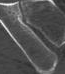
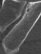

# Sacroiliitis grading

## Inputs

The grading model takes a grayscale ROI and the corresponding three-channel structural prior: binary mask, signed distance transform (SDT), and boundary band. The prior is constructed from the ROI mask by the code; separate SDT/band image files are not required. Both branches are resized to 224x224.

| Side | ROI intensity | ROI mask |
|---|---|---|
| Left |  |  |
| Right |  |  |

These crops are derived from the [paper-example masks](../segment/README.md) using the same-side union bounding rectangle, without padding. They illustrate the input format. Actual validation and test inputs must be generated from segmentation predictions.

`data/Dataset_A/train/labels.csv` and `data/Dataset_A/val/labels.csv` contain the supplied labels (`filename,left,right`). Prepare the corresponding images and masks as described in [USAGE.md](../docs/USAGE.md).

## Train

`train.py` is the only grading training entry point. Run from the repository root:

```bash
python -m model.train --data-root /path/to/grading_data --output-dir outputs/grading_weights
```

It trains independent left/right networks and saves best, final and, when averaging has started, SWA checkpoints. Best weights are selected by EMA validation accuracy. The reported SIGNet grading results use the left/right `*_best.pth` checkpoints (EMA decay 0.999). SWA checkpoints are saved separately and were not used for those reported results. Per-side validation reports are training diagnostics, not the paper's pooled test-set results.

## Predict

First generate segmentation predictions using the command in [segment/README.md](../segment/README.md). Then run:

```bash
python -m model.predict --roi-dir outputs/example_segment/roi --mask-dir outputs/example_segment/roi_masks --slice-manifest model/examples/slice_manifest.csv --checkpoint-left /path/to/dualfuse_band_left_best.pth --checkpoint-right /path/to/dualfuse_band_right_best.pth --output-dir outputs/example_grading
```

## Outputs

- `slice_predictions.csv`: patient/case/slice identifiers, slice order, image path, ROI filename, side, predicted grade and probabilities `prob_0` through `prob_4`.
- `case_predictions.csv`: patient/case identifiers, `left_grade`, `right_grade` and `case_grade`.
- `inference_metadata.json`: weight checksums, ordering and aggregation settings.

Each side retains a nonzero grade only if it occurs on at least two consecutive slices. The highest retained grade is selected, then the higher bilateral grade becomes the case grade. The single-slice example illustrates file format only and cannot demonstrate this continuity criterion. Its illustrative identifiers are not linked to Dataset A labels.
