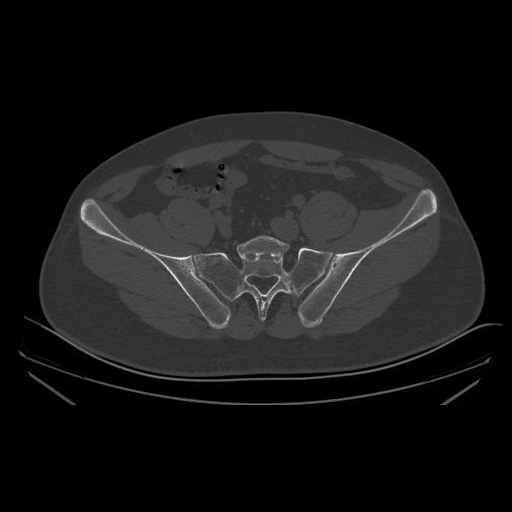
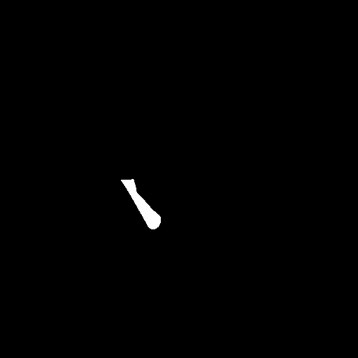
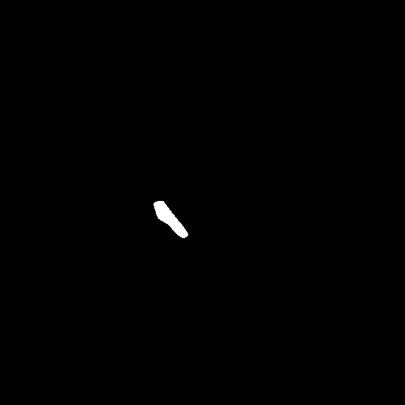
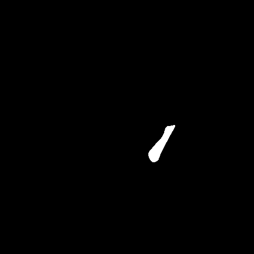
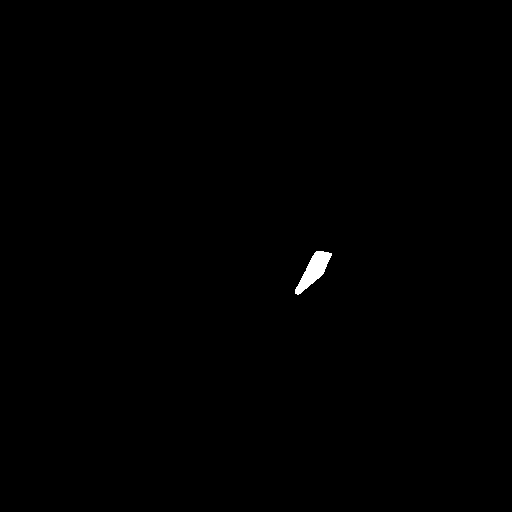
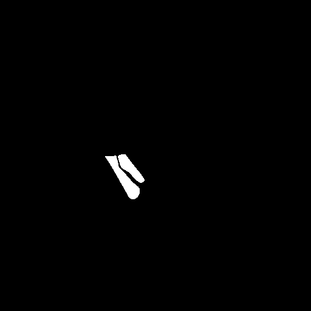
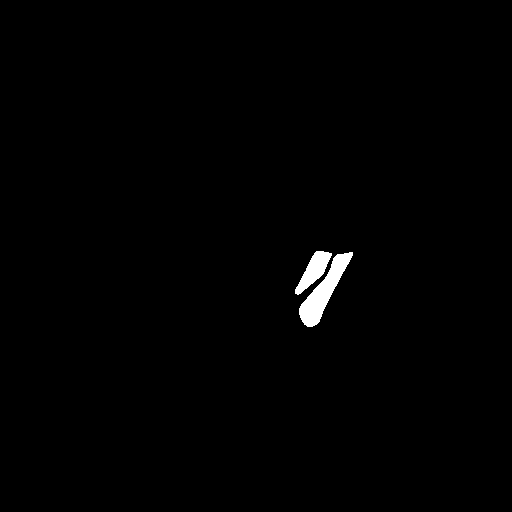

# Segmentation

Pretrained weights: [Download from pCloud](https://u.pcloud.link/publink/show?code=kZKMXQJZNhfIrzsbF6J0iHGvpCBHfQ0JeWhX).

## Input and output

Input: grayscale CT slices. Each image is resized to 512x512 and split into two 512x256 halves. Four independent models predict LI, LS, RI and RS masks. Same-side ilium and sacrum masks are united; their tight bounding rectangle defines the ROI.

| CT input | LI | LS | RI | RS |
|---|---|---|---|---|
|  |  |  |  |  |

| Left union mask | Right union mask |
|---|---|
|  |  |

These are author-supplied paper-example masks, preserved pixel-for-pixel. They illustrate the output format and are not presented as a recorded run of the downloadable checkpoints. `examples/source.json` records their source, checksums and crop coordinates. The corresponding ROI crops and ROI masks are shown in [grading inputs](../model/README.md#inputs).

LI/LS use the left half of the stored image and RI/RS the right half, following the supplied dataset convention. Preserve this orientation when preparing images and labels.

## Train

Run from the repository root:

```bash
python -m segment.train --data-root /path/to/segmentation_data --output-dir outputs/segment_weights
```

## Predict

```bash
python -m segment.predict --input-dir segment/examples/input/input.png --checkpoint-dir /path/to/segmentation_weights --output-dir outputs/example_segment
```

Generated files:

- `masks_4models/`: four binary structure masks in full-image coordinates.
- `roi/`: grayscale left/right ROI images.
- `roi_masks/`: matching cropped union masks for grading.
- `inference_metadata.json`: weight checksums, thresholds and prediction provenance.
- `segmentation_qc.csv`: status and foreground areas for each input.

`preview.py` optionally creates colored overlays. `calibrate_thresholds.py` searches thresholds on the validation split; the supplied checkpoints already contain selected thresholds, so this is not required for normal prediction. Thresholds must be fixed before test-set evaluation.
